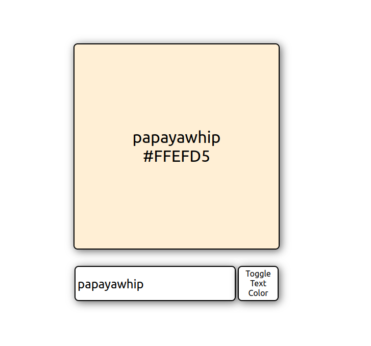
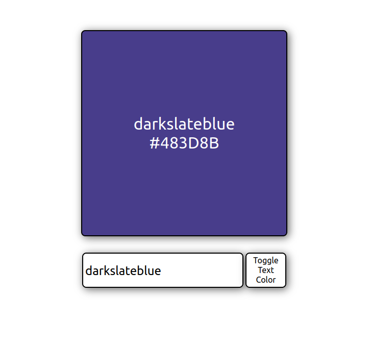

# Welcome to <strong>Challenge1</strong> from [React tutorial](https://www.youtube.com/watch?v=RVFAyFWO4go) on YT.

## Challenge:
Make a box that would change the color as you type the color name in the input below. 

## How it looks:

One can toggle color to white so it is visible with dark background.

